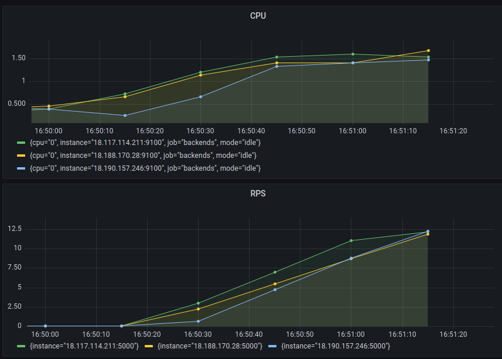

# Highload, load balancer

### Backends  
- 18.188.170.28:5000 (local 172.31.39.47:5000)
- 18.190.157.246:5000 (local 172.31.40.212:5000)
- 18.117.114.211:5000 (local 172.31.37.48:5000)
### Database
- 3.22.112.0:5432 (local 172.31.38.13:5432)
### Balancer  
- 52.14.226.109 (local 172.31.36.152)

### RPS & CPU, load applied:
ab -n 10000 -c 10 http://52.14.226.109/api/user/l.sparrow/profile

### RPS & CPU, one backend is disabled at 16:53:30:

### Sources:
- VM creating AWS  
https://devopsmyway.com/linux-virtual-machine-on-aws/

- Prometheus and Grafana install steps:  
https://help.reg.ru/hc/ru/articles/4408054706193-%D0%A1%D0%B8%D1%81%D1%82%D0%B5%D0%BC%D0%B0-%D0%BC%D0%BE%D0%BD%D0%B8%D1%82%D0%BE%D1%80%D0%B8%D0%BD%D0%B3%D0%B0-Prometheus  
https://eax.me/prometheus-and-grafana/

- Postgres installing on vm:  
https://techviewleo.com/install-postgresql-12-on-amazon-linux/

- Golang installing on vm:  
https://www.systutorials.com/how-to-install-go-1-13-x-on-ubuntu-18-04/

- Nginx:  
https://serveradmin.ru/ustanovka-i-nastrojka-nginx/#i-4

- Nginx balancer:  
https://serveradmin.ru/nginx-v-kachestve-balansirovshhika-nagruzki/

- Golang version updating:
https://www.jajaldoang.com/post/how-to-update-golang/
